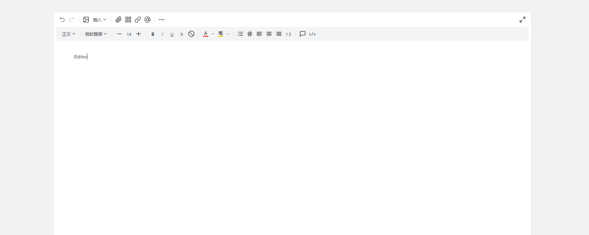

# JEditor

Language: English | [中文](README.md)

Open source repository: [https://github.com/JenkinAAA/JEditor](https://github.com/JenkinAAA/JEditor)

Current version: `v1.0.8`

JEditor is a web rich text editor for document authoring, static HTML fragment editing, and Source HTML editing. It is built on top of Tiptap, but the current version is no longer just a toolbar wrapper. It is evolving into a hybrid editor that supports visual editing, source editing, HTML preservation, and direct CDN usage.



## Goals

JEditor is not trying to simply clone a traditional rich text editor. Its core goal is harder:

`Let users edit content like a document while preserving raw HTML as much as possible.`

That is the key difference between JEditor and conventional editors:

- most editors focus on structured content only
- JEditor cares about both structured editing and HTML survivability

## Current capabilities

The current version already includes:

- dual-toolbar editing UI
- native HTML bootstrap from a container
- `textarea` bootstrap with automatic sync
- ESM / UMD / IIFE builds
- direct CDN integration without npm
- Source toggle button
- source editor on the left and high-fidelity preview on the right
- full HTML document preservation
- fragment HTML preprocess and restore flow
- Raw HTML Block placeholders
- core editing features:
  - undo / redo
  - format painter
  - clear format
  - heading / paragraph
  - font family / font size
  - bold / italic / underline / strike
  - color
  - blockquote
  - inline code
  - code block
  - lists
  - link
  - table
  - image
  - callout
  - fullscreen

## Current severe bugs

These are planned to be addressed in the next version, targeted before `2026.06`.

- Table styling still has readability and editing issues in real document scenarios
- Table interaction logic is still unstable, especially handles, resizing, and dragging
- Callout focus handling and interaction logic still have defects that affect usability

For other bugs, please open an [Issue](https://github.com/JenkinAAA/JEditor/issues).

## Architecture overview

JEditor follows a hybrid architecture centered around “Source HTML as the single source of truth”:

```text
Source HTML
   -> Parser / Preprocess
   -> Projection
   -> Visual Editor (Tiptap)
   -> restoreRawHTML()
   -> Output HTML
```

You can think of it as three layers:

1. Source Layer
   - stores the original HTML
   - keeps full documents source-authoritative
   - powers the high-fidelity preview

2. Projection Layer
   - preprocesses HTML before `setContent`
   - sends supported nodes into the schema
   - wraps unknown nodes as `RawHtmlIsland`

3. Visual Layer
   - uses Tiptap for structured editing
   - all toolbar, plugin, command, and selection logic lives here

## Three editing states

### 1. Visual Mode

This is the default mode. It is used for structured editing such as writing paragraphs, formatting text, inserting tables, callouts, images, and code blocks.

This layer mainly depends on Tiptap for:

- selection handling
- command chains
- schema
- history
- node and mark extensions

### 2. Source Mode

Enter it by clicking the `Source` button.

The current implementation is:

- left: source editor `textarea`
- right: high-fidelity iframe preview

When the content is a full HTML document, JEditor does not force it back through the visual editor. This avoids losing or normalizing:

- `<!DOCTYPE html>`
- `<head>`
- `<style>`
- `<script>`
- the original document structure

### 3. Hybrid / Preservation Flow

This is currently the most important layer in JEditor.

For fragment HTML, JEditor preprocesses content before `setContent()`:

- supported nodes are parsed normally
- unsupported nodes are wrapped as `raw-html` placeholders

When exporting, `restoreRawHTML()` turns them back into their original HTML.

The goal is simple:

`Unknown HTML may not be editable, but it must not be deleted.`

## HTML preservation

The current HTML preservation flow can be understood in three simple steps:

1. `preprocessHTML`
   - runs before `setContent()`
   - supported nodes go into the visual editor
   - unsupported nodes are converted into `raw-html`

2. `RawHtmlIsland`
   - acts as an indivisible block node
   - preserves original HTML instead of forcing it into a structured schema

3. `restoreRawHTML`
   - runs during `getHTML()`
   - restores `raw-html` placeholders back to their original `outerHTML`

This means that even if some HTML cannot be edited visually, it can still survive export as intact HTML.

## Plugin system

JEditor uses a plugin-driven toolbar and command architecture.

A plugin usually contains:

- `name`
- `toolbar`
- `tiptapExtension`
- `command`
- `isActive`
- `renderPopover`
- `init / destroy`

This gives JEditor a few advantages:

- UI and commands stay decoupled
- toolbar items can be composed by configuration
- new tools can be added without rewriting the core editor

## Install and development

```bash
npm install
npm run dev
npm run build
npm run preview
```

Build outputs:

- `dist/jeditor.es.js`
- `dist/jeditor.umd.js`
- `dist/jeditor.iife.js`
- `dist/jeditor.css`

## ESM usage

```js
import '@jenkin-a/jeditor/dist/jeditor.css'
import { JEditor } from '@jenkin-a/jeditor'

const editor = JEditor.create('#editor', {
  placeholder: 'Start writing...',
})
```

You can also create from an HTML string:

```js
const editor = JEditor.fromHTML('#editor', '<h2>Hello</h2><p>World</p>')
```

## CDN / no-npm usage

```html
<link rel="stylesheet" href="https://unpkg.com/@jenkin-a/jeditor@1.0.8/dist/jeditor.css">
<script src="https://unpkg.com/feather-icons"></script>
<script src="https://unpkg.com/@jenkin-a/jeditor@1.0.8/dist/jeditor.iife.js"></script>

<div id="editor">
  <h2>Hello, JEditor</h2>
  <p>The native HTML inside this container will be parsed on startup.</p>
</div>

<script>
  const editor = window.JEditor.create('#editor', {
    placeholder: 'Start writing...',
  })
</script>
```

## API

```js
editor.getHTML()
editor.getJSON()
editor.getText()
editor.setContent('<p>Hello</p>')
editor.importHTML('<p>Hello</p>')
editor.focus()
editor.destroy()
editor.toggleSourceMode()
```

## Good fit for

JEditor is a good fit for:

- enterprise knowledge-base editors
- SOP / notice / documentation workbenches
- CMS editors that need Source HTML support
- admin systems that need both visual editing and HTML editing
- lightweight browser integrations via CDN

## Current boundaries

The current version is already strong, but it is still evolving.

Some current boundaries:

- some UI details still need polishing
- a few toolbar interactions can be refined further
- complex unknown inline HTML preservation is not final yet
- Source Mode and Hybrid Mode will continue to evolve

## License

MIT
